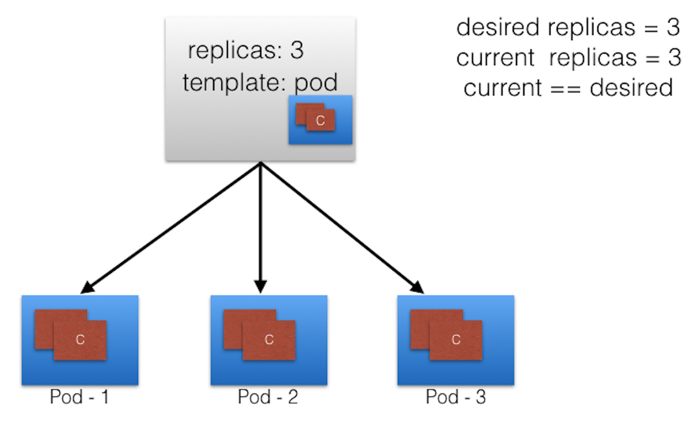
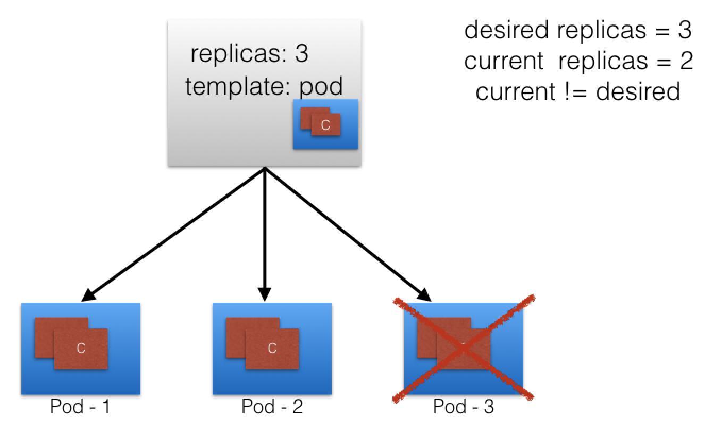
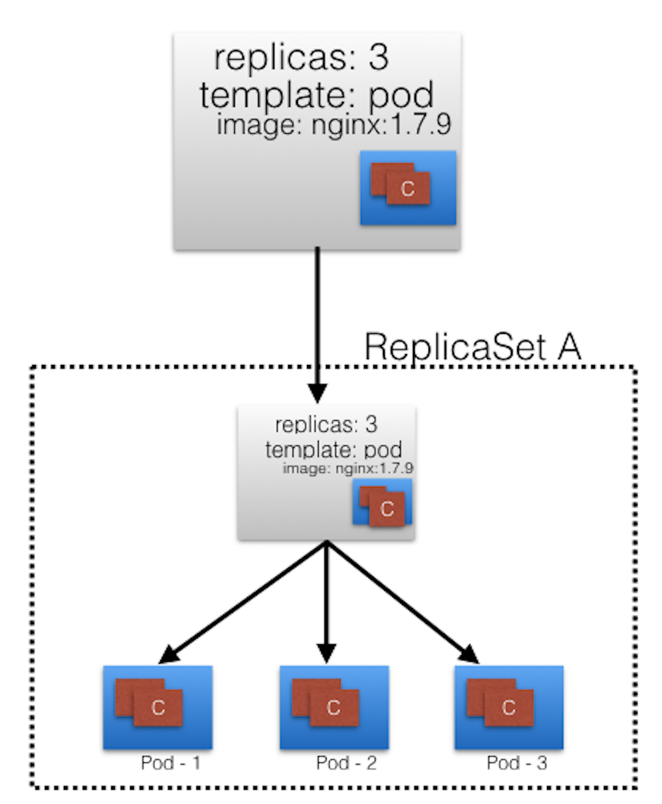
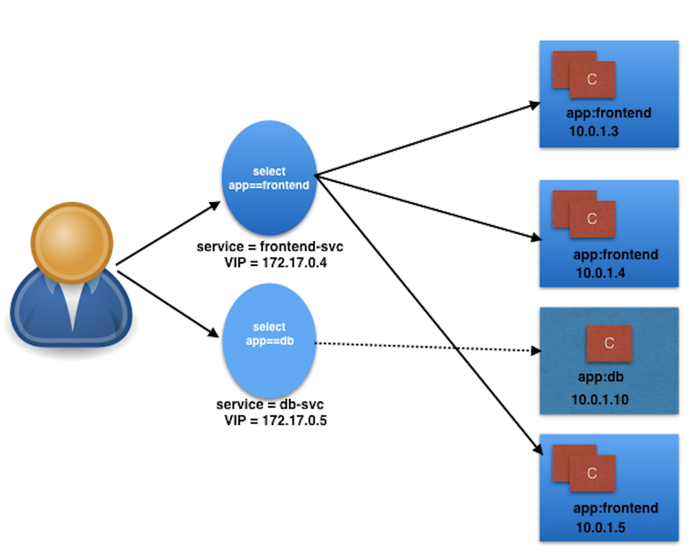

## Info & Docs
[Kubernetes Documentation -
 Tutorials](https://kubernetes.io/docs/tutorials/)
 
 [Introduction to Kubernetes](https://learning.edx.org/course/course-v1:LinuxFoundationX+LFS158x+3T2020/home)
 
 [LinkedIn Learning Course - Learning Kubernetes by Karthik Gaekwad](https://www.linkedin.com/learning/learning-kubernetes/welcome?u=42751868)
 
## Doc
####What Is Kubernetes?
Kubernetes is an open-source system for automating deployment, scaling, and management of containerized applications.

Kubernetes is also referred to as **k8s (pronounced Kate's)**, as there are 8 characters between k and s.

Kubernetes was started by Google and, with its v1.0 release in July 2015, Google donated it to the Cloud Native Computing Foundation (CNCF).

####Kubernetes Features
Kubernetes offers a very rich set of features for container orchestration. Some of its fully supported features are:

* **Automatic bin packing**

     Kubernetes automatically schedules containers based on resource needs and constraints, to maximize utilization without sacrificing availability.

* **Self-healing**

    Kubernetes automatically replaces and reschedules containers from failed nodes. It kills and restarts containers unresponsive to health checks, based on existing rules/policy. It also prevents traffic from being routed to unresponsive containers.

* **Horizontal scaling**
    
    With Kubernetes applications are scaled manually or automatically based on CPU or custom metrics utilization.

* **Service discovery and Load balancing**
    
    Containers receive their own IP addresses from Kubernetes, while it assigns a single Domain Name System (DNS) name to a set of containers to aid in load-balancing requests across the containers of the set.
    
* **Automated rollouts and rollbacks**
    Kubernetes seamlessly rolls out and rolls back application updates and configuration changes, constantly monitoring the application's health to prevent any downtime.
    
* **Secret and configuration management**
    Kubernetes manages sensitive data and configuration details for an application separately from the container image, in order to avoid a re-build of the respective image. Secrets consist of sensitive/confidential information passed to the application without revealing the sensitive content to the stack configuration, like on GitHub.
    
* **Storage orchestration**
    Kubernetes automatically mounts software-defined storage (SDS) solutions to containers from local storage, external cloud providers, distributed storage, or network storage systems.
    
* **Batch execution**
    Kubernetes supports batch execution, long-running jobs, and replaces failed containers.
    
#### Architecture


##### Master node 
 Master node provides a running environment for the control plane responsible for **managing the state of a Kubernetes cluster, and it is the brain behind all operations inside the cluster**. 
 
**The control plane components are agents with very distinct roles in the cluster's management**. 
 
 In order to communicate with the Kubernetes cluster, users send requests to the control plane via
 * Command Line Interface (CLI) tool
 * Web User-Interface (Web UI) Dashboard
 * Application Programming Interface (API).
 
 It is important to keep the control plane running at all costs. Losing the control plane may introduce downtime, causing service disruption to clients, with possible loss of business. To ensure the control plane's fault tolerance, master node replicas can be added to the cluster, configured in High-Availability (HA) mode. While only one of the master nodes is dedicated to actively manage the cluster, the control plane components stay in sync across the master node replicas. This type of configuration adds resiliency to the cluster's control plane, should the active master node fail.
 
To persist the Kubernetes cluster's state, all cluster configuration data is saved to **etcd**. etcd is a distributed key-value store which only holds cluster state related data, no client workload data

#### Master Node Components
A master node runs the following control plane components:

* API Server
* Scheduler
* Controller Managers
* Data Store.

In addition, the master node runs:

* Container Runtime
* Node Agent
* Proxy

#### Master Node Components: API Server
All the administrative tasks are coordinated by the **kube-apiserver**, a central control plane component running on the master node. 

The API Server intercepts RESTful calls from users, operators and external agents, then validates and processes them. During processing the API Server reads the Kubernetes cluster's current state from the etcd data store, and after a call's execution, the resulting state of the Kubernetes cluster is saved in the distributed key-value data store for persistence. The API Server is the only master plane component to talk to the etcd data store, both to read from and to save Kubernetes cluster state information - acting as a middle interface for any other control plane agent inquiring about the cluster's state.

#### Master Node Components: Scheduler
The role of the **kube-scheduler** is to assign new workload objects, **such as pods**, to nodes. 

During the scheduling process, decisions are made based on current Kubernetes cluster state and new object's requirements. The scheduler obtains from the etcd data store, via the API Server, resource usage data for each worker node in the cluster. The scheduler also receives from the API Server the new object's requirements which are part of its configuration data.

#### Master Node Components: Controller Managers
The **controller managers** are control plane components on the master node running controllers to regulate the state of the Kubernetes cluster. 

Controllers are watch-loops continuously running and comparing the cluster's desired state (provided by objects' configuration data) with its current state (obtained from etcd data store via the API server). In case of a mismatch corrective action is taken in the cluster until its current state matches the desired state.

The kube-controller-manager runs controllers responsible to act when nodes become unavailable, to ensure pod counts are as expected, to create endpoints, service accounts, and API access tokens.

The cloud-controller-manager runs controllers responsible to interact with the underlying infrastructure of a cloud provider when nodes become unavailable, to manage storage volumes when provided by a cloud service, and to manage load balancing and routing.

#### Master Node Components: Data Store
**etcd** is a strongly consistent, distributed key-value data store used to persist a Kubernetes cluster's state. 

New data is written to the data store only by appending to it, data is never replaced in the data store. Obsolete data is compacted periodically to minimize the size of the data store.

Out of all the control plane components, only the API Server is able to communicate with the etcd data store.

#### Worker Node Overview
A worker node provides a running environment for client applications. 

Though containerized microservices, these applications are encapsulated in Pods, controlled by the cluster control plane agents running on the master node. 

Pods are scheduled on worker nodes, where they find required compute, memory and storage resources to run, and networking to talk to each other and the outside world. A Pod is the smallest scheduling unit in Kubernetes. It is a logical collection of one or more containers scheduled together, and the collection can be started, stopped, or rescheduled as a single unit of work

#### Worker Node Components
A worker node has the following components:

* Container Runtime
* Node Agent - kubelet
* Proxy - kube-proxy
* Addons for DNS, Dashboard user interface, cluster-level monitoring and logging.

#### Worker Node Components: Node Agent - kubelet
The kubelet is an agent running on each node and communicates with the control plane components from the master node. It receives Pod definitions, primarily from the API Server, and interacts with the container runtime on the node to run containers associated with the Pod. It also monitors the health and resources of Pods running containers.

#### Worker Node Components: Proxy - kube-proxy
The kube-proxy is the network agent which runs on each node responsible for dynamic updates and maintenance of all networking rules on the node. It abstracts the details of Pods networking and forwards connection requests to Pods.

The kube-proxy is responsible for TCP, UDP, and SCTP stream forwarding or round-robin forwarding across a set of Pod backends, and it implements forwarding rules defined by users through Service API objects.

#### Worker Node Components: Addons
Addons are cluster features and functionality not yet available in Kubernetes, therefore implemented through 3rd-party pods and services.

* **DNS** - cluster DNS is a DNS server required to assign DNS records to Kubernetes objects and resources
* **Dashboard** - a general purposed web-based user interface for cluster management
* **Monitoring** - collects cluster-level container metrics and saves them to a central data store
* **Logging** - collects cluster-level container logs and saves them to a central log store for analysis.

#### Pod-to-External World Communication
A successfully deployed containerized application running in Pods inside a Kubernetes cluster may require accessibility from the outside world. **Kubernetes enables external accessibility through Services, complex encapsulations of network routing rule definitions stored in iptables on cluster nodes and implemented by kube-proxy agents**. 

By exposing services to the external world with the aid of kube-proxy, applications become accessible from outside the cluster over a virtual IP address.

#### Kubernetes Configuration
Kubernetes can be installed using different cluster configurations. The major installation types are described below:

* **All-in-One Single-Node Installation**
    In this setup, all the master and worker components are installed and running on a single-node. While it is useful for learning, development, and testing, it should not be used in production. Minikube is an installation tool originally aimed at single-node cluster installations, and we are going to explore it in future chapters.

* **Single-Master and Multi-Worker Installation**
    In this setup, we have a single-master node running a stacked etcd instance. Multiple worker nodes can be managed by the master node.

* **Single-Master with Single-Node etcd, and Multi-Worker Installation**
    In this setup, we have a single-master node with an external etcd instance. Multiple worker nodes can be managed by the master node.

* **Multi-Master and Multi-Worker Installation**
    In this setup, we have multiple master nodes configured for High-Availability (HA), with each master node running a stacked etcd instance. The etcd instances are also configured in an HA etcd cluster and, multiple worker nodes can be managed by the HA masters.

* **Multi-Master with Multi-Node etcd, and Multi-Worker Installation**
    In this setup, we have multiple master nodes configured in HA mode, with each master node paired with an external etcd instance. The external etcd instances are also configured in an HA etcd cluster, and multiple worker nodes can be managed by the HA masters. This is the most advanced cluster configuration recommended for production environments.
    
    
####Localhost Installation
There are a variety of installation tools allowing us to deploy single - or multi-node Kubernetes clusters on our workstations. While not an exhaustive list, below we enumerate a few popular ones:

* **Minikube** - single-node local Kubernetes cluster, recommended for a learning environment deployed on a single host. 

* **Kind** - multi-node Kubernetes cluster deployed in Docker containers acting as Kubernetes nodes, recommended for a learning environment. 

* **Docker Desktop** - including a local Kubernetes cluster for Docker users. 

* **MicroK8s** - local and cloud Kubernetes cluster, from Canonical.
 
* **K3S** - lightweight Kubernetes cluster for local, cloud, edge, IoT deployments, from Rancher. 

**Minikube** is the easiest and most preferred method to create an all-in-one Kubernetes setup locally.

#### Kubernetes Installation Tools/Resources
Some useful installation tools available: 
* **kubeadm** 
kubeadm is a first-class citizen on the Kubernetes ecosystem. It is a secure and recommended method to bootstrap a multi-node production ready Highly Available Kubernetes cluster, on-prem or in the cloud.
    
* **kubespray**
With kubespray (formerly known as kargo), we can install Highly Available production ready Kubernetes clusters on AWS, GCE, Azure, OpenStack, vSphere, or bare metal. Kubespray is based on Ansible, and is available on most Linux distributions. It is a Kubernetes Incubator project.

* **kops**
With kops, we can create, upgrade, and maintain production-grade, Highly Available Kubernetes clusters from the command line. It can provision the machines as well. Currently, AWS is officially supported.

* **kube-aws**
  With kube-aws we can create, upgrade and destroy Kubernetes clusters on AWS from the command line. Kube-aws is also a Kubernetes Incubator project.
  
#### Minikube - Installation & Details
Minikube is the easiest and most popular method to run an all-in-one Kubernetes cluster in a virtual machine (VM) locally on our workstations. Minikube is the tool responsible for the installation of Kubernetes components, cluster bootstrapping, and cluster tear-down when no longer needed. It includes a few additional tools aimed to ease the user interaction with the Kubernetes cluster, but nonetheless, it initializes for us an all-in-one single-node Kubernetes cluster. While the latest Minikube release also supports multi-node Kubernetes clusters, this feature is still experimental. 

[minikube installation steps](https://minikube.sigs.k8s.io/docs/start/)
 
#### Accessing Minikube
Any healthy running Kubernetes cluster can be accessed via any one of the following methods:

* **Command Line Interface (CLI) tools and scripts**
* **Web-based User Interface (Web UI) from a web browser**
* **APIs from CLI or programmatically**

These methods are applicable to all Kubernetes clusters. 

#### Accessing Minikube: Command Line Interface (CLI)
kubectl is the Kubernetes Command Line Interface (CLI) client to manage cluster resources and applications. 

[install-kubectl-macos](https://kubernetes.io/docs/tasks/tools/install-kubectl-macos/)

It is very flexible and easy to integrate with other systems, therefore it can be used standalone, or part of scripts and automation tools. Once all required credentials and cluster access points have been configured for kubectl, it can be used remotely from anywhere to access a cluster.

#### kubectl Configuration File
To access the Kubernetes cluster, the kubectl client needs the master node endpoint and appropriate credentials to be able to securely interact with the API server running on the master node. 

While starting Minikube, the startup process creates, by default, a configuration file, config, inside the.kube directory (often referred to as the kubeconfig), which resides in the user's home directory. 

The configuration file has all the connection details required by kubectl. By default, the kubectl binary parses this file to find the master node's connection endpoint, along with credentials. Multiple kubeconfig files can be configured with a single kubectl client.

`$ kubectl config view`

`$kubectl cluster-info`

[More Details on kubectl](https://kubernetes.io/docs/reference/kubectl/overview/)

#### Accessing Minikube: Web-based User Interface (Web UI)
The Kubernetes Dashboard provides a Web-Based User Interface (Web UI) to interact with a Kubernetes cluster to manage resources and containerized applications.

##### Dashborad in Minikube cluster
`$ minikube dashboard`
 

##### Dashborad in Docker Desktop  
[running-kubernetes-and-the-dashboard-with-docker-desktop/](https://andrewlock.net/running-kubernetes-and-the-dashboard-with-docker-desktop/)

```shell script
>  kubectl proxy
Starting to serve on 127.0.0.1:8001
```

[dashboard url](http://localhost:8001/api/v1/namespaces/kubernetes-dashboard/services/https:kubernetes-dashboard:/proxy/) 

#### APIs with 'kubectl proxy'
When kubectl proxy is running, we can send requests to the API over the localhost on the default proxy port 8001 (from another terminal, since the proxy locks the first terminal when running in foreground):

```shell script
>  kubectl proxy
Starting to serve on 127.0.0.1:8001
```

```shell script
$ curl http://localhost:8001/

{
 "paths": [
   "/api",
   "/api/v1",
   "/apis",
   "/apis/apps",
   ......
   ......
   "/logs",
   "/metrics",
   "/openapi/v2",
   "/version"
 ]
}
```

With the above curl request, we requested all the API endpoints from the API server. Clicking on the link above (in the curl command), it will open the same listing output in a browser tab.

We can explore several path combinations with curl or in a browser as well, such as:

http://localhost:8001/api/v1

http://localhost:8001/apis/apps/v1

http://localhost:8001/healthz

http://localhost:8001/metrics

#### Kubernetes Object Model
Kubernetes has a very rich object model, representing different persistent entities in the Kubernetes cluster. Those entities describe:

* What containerized applications we are running
* The nodes where the containerized applications are deployed
* Application resource consumption
* Policies attached to applications, like restart/upgrade policies, fault tolerance, etc.

The Kubernetes system manages the status section for objects, where it records the actual state of the object. At any given point in time, the Kubernetes Control Plane tries to match the object's actual state to the object's desired state.

Examples of Kubernetes objects are Pods, ReplicaSets, Deployments, Namespaces, etc.

##### Pods
A Pod is the smallest and simplest Kubernetes object. It is the unit of deployment in Kubernetes, which represents a single instance of the application. A Pod is a logical collection of one or more containers, which:

* Are scheduled together on the same host with the Pod
* Share the same network namespace, meaning that they share a single IP address originally assigned to the Pod
* Have access to mount the same external storage (volumes).


Pods are used with controllers which handle Pods' replication, fault tolerance, self-healing, etc. Examples of controllers are Deployments, ReplicaSets, ReplicationControllers, etc. We attach a nested Pod's specification to a controller object using the Pod Template

Below is an example of a Pod object's configuration manifest in YAML format:
```yaml
apiVersion: v1
kind: Pod
metadata:
  name: nginx-pod
  labels:
    app: nginx
spec:
  containers:
  - name: nginx
    image: nginx:1.15.11
    ports:
    - containerPort: 80
```
* **apiVersion** field must specify v1 for the Pod object definition
* **kind** specifying the Pod object type
* **metadata** holds the object's name and label
* **spec** defines the desired state of the Pod object - also named the PodSpec. Our Pod creates a single container running the nginx:1.15.11 image from Docker Hub
* **containerPort** field specifies the container port to be exposed by Kubernetes resources for inter-application access or external client access.

##### Labels
Labels are key-value pairs attached to Kubernetes objects (e.g. Pods, ReplicaSets, Nodes, Namespaces, Persistent Volumes). 

Labels are used to organize and select a subset of objects, based on the requirements in place. Many objects can have the same Label(s). Labels do not provide uniqueness to objects. Controllers use Labels to logically group together decoupled objects, rather than using objects' names or IDs.


In the image above, we have used two Label keys: app and env. Based on our requirements, we have given different values to our four Pods. 
* The Label **env=dev** logically selects and groups the top two Pods, 
* the Label **app=frontend** logically selects and groups the left two Pods. 
* We can select one of the four Pods - bottom left, by selecting two Labels: **app=frontend AND env=qa**.

##### Label Selectors
Controllers use Label Selectors to select a subset of objects.


##### ReplicaSet Controller
The default recommended controller is the **Deployment** which configures a **ReplicaSet** controller to manage Pods' lifecycle.

A ReplicaSet ensures a specified number of replicas of a Pod is running at any given time, by constantly comparing the actual state with the desired state of the managed application. If there are more Pods than the desired count, the replication controller randomly terminates the number of Pods exceeding the desired count, and, if there are fewer Pods than the desired count, then the replication controller requests additional Pods to be created until the actual count matches the desired count. 

Generally, we do not deploy a Pod independently, as it would not be able to re-start itself if terminated in error because a Pod misses the much desired self-healing feature that Kubernetes otherwise promises. The recommended method is to use some type of a controller to run and manage Pods

Below we graphically represent a ReplicaSet, with the replica count set to 3 for a specific Pod template. Pod-1, Pod-2, and Pod-3 are identical, running the same application container image, being cloned from the same Pod template. For now, the current state matches the desired state. 



Let's continue with the same ReplicaSet example and assume that one of the Pods is forced to unexpectedly terminate (due to insufficient resources, timeout, etc.), causing the current state to no longer match the desired state.

 

The ReplicaSet detects that the current state is no longer matching the desired state and triggers a request for an additional Pod to be created, thus ensuring that the current state matches the desired state.


**`Deployments manage the creation, deletion, and updates of Pods. A Deployment automatically creates a ReplicaSet, which then creates a Pod. There is no need to manage ReplicaSets and Pods separately, the Deployment will manage them on our behalf.`**

##### Deployment
**Deployment** objects provide declarative updates to Pods and ReplicaSets. 

The DeploymentController is part of the master node's controller manager, and as a controller it also ensures that the current state always matches the desired state. 

It allows for seamless application updates and rollbacks through **rollouts** and **rollbacks**, and it directly manages its ReplicaSets for application scaling.

In the following example, a new Deployment creates ReplicaSet A which then creates 3 Pods, with each Pod Template configured to run one nginx:1.7.9 container image. In this case, the ReplicaSet A is associated with nginx:1.7.9 representing a state of the Deployment. This particular state is recorded as Revision 1.

 

In time, we need to push updates to the application managed by the Deployment object. Let's change the Pods' Template and update the container image from nginx:1.7.9 to nginx:1.9.1. 

The Deployment triggers a new ReplicaSet B for the new container image versioned 1.9.1 and this association represents a new recorded state of the Deployment, Revision 2. The seamless transition between the two ReplicaSets, from ReplicaSet A with 3 Pods versioned 1.7.9 to the new ReplicaSet B with 3 new Pods versioned 1.9.1, or from Revision 1 to Revision 2, is a **Deployment rolling update**.

A **rolling update** is triggered when we update specific properties of the Pod Template for a deployment. While updating the container image, container port, volumes, and mounts would trigger a new Revision, other operations like scaling or labeling the deployment do not trigger a rolling update, thus do not change the Revision number.

Once the rolling update has completed, the Deployment will show both ReplicaSets A and B, where A is scaled to 0 (zero) Pods, and B is scaled to 3 Pods. This is how the Deployment records its prior state configuration settings, as Revisions.

 

Below is an example of a Deployment object's configuration manifest in YAML format:
```yaml
apiVersion: apps/v1
kind: Deployment
metadata:
  name: nginx-deployment
  labels:
    app: nginx
spec:
  replicas: 3
  selector:
    matchLabels:
      app: nginx
  template:
    metadata:
      labels:
        app: nginx
    spec:
      containers:
      - name: nginx
        image: nginx:1.15.11
        ports:
        - containerPort: 80
```

* **apiVersion field** is the first required field, and it specifies the API endpoint on the API server which we want to connect to; it must match an existing version for the object type defined. 

* **kind** field specify the object type - in our case it is Deployment, but it can be Pod, Replicaset, Namespace, Service, etc. 

* **metadata field** holds the object's basic information, such as name, labels, namespace, etc. 
 
* **spec field** marks the beginning of the block defining the desired state of the Deployment object. **In our example**, we are requesting that **3 replicas, or 3 instances of the Pod**, are running at any given time. The Pods are created using the Pod Template defined in spec.template. A nested object, such as the Pod being part of a Deployment, retains its metadata and spec and loses the apiVersion and kind - both being replaced by template. In spec.template.spec, we define the desired state of the Pod. Our Pod creates a single container running the nginx:1.15.11 image from Docker Hub.

Once the Deployment object is created, the Kubernetes system attaches the status field to the object and populates it with all necessary status fields. 

#####Namespaces
If multiple users and teams use the same Kubernetes cluster we can partition the cluster into virtual sub-clusters using Namespaces. The names of the resources/objects created inside a Namespace are unique, but not across Namespaces in the cluster.

To list all the Namespaces, we can run the following command:

```shell script
$ kubectl get namespaces
NAME              STATUS       AGE
default           Active       11h
kube-node-lease   Active       11h
kube-public       Active       11h
kube-system       Active       11h
```

Generally, Kubernetes creates four Namespaces out of the box: **kube-system, kube-public, kube-node-lease, and default**. 

The **kube-system** Namespace contains the objects created by the Kubernetes system, mostly the control plane agents. 

The **default Namespace** contains the objects and resources created by administrators and developers, and objects are assigned to it by default unless another Namespace name is provided by the user. 

**kube-public** is a special Namespace, which is unsecured and readable by anyone, used for special purposes such as exposing public (non-sensitive) information about the cluster.

##### Example
```shell script
~ kubectl create deployment mynginx --image=nginx:1.15-alpine
        deployment.apps/mynginx created   

 ~ kubectl get deployment,rs,pod -l app=mynginx
        NAME                      READY   UP-TO-DATE   AVAILABLE   AGE
        deployment.apps/mynginx   1/1     1            1           88s
        
        NAME                                 DESIRED   CURRENT   READY   AGE
        replicaset.apps/mynginx-847485c545   1         1         1       88s
        
        NAME                           READY   STATUS    RESTARTS   AGE
        pod/mynginx-847485c545-g7csv   1/1     Running   0          88s

~ kubectl scale deploy mynginx --replicas=3
        deployment.apps/mynginx scaled

➜  ~ kubectl get deployment,rs,pod -l app=mynginx
        NAME                      READY   UP-TO-DATE   AVAILABLE   AGE
        deployment.apps/mynginx   3/3     3            3           4m10s
        
        NAME                                 DESIRED   CURRENT   READY   AGE
        replicaset.apps/mynginx-847485c545   3         3         3       4m10s
        
        NAME                           READY   STATUS    RESTARTS   AGE
        pod/mynginx-847485c545-6446m   1/1     Running   0          17s
        pod/mynginx-847485c545-g7csv   1/1     Running   0          4m10s
        pod/mynginx-847485c545-rrtrw   1/1     Running   0          17s

 ~ kubectl describe deployment mynginx

 ~ kubectl rollout history deploy mynginx
        deployment.apps/mynginx
        REVISION  CHANGE-CAUSE
        1         <none>

 ~ kubectl rollout history deploy mynginx --revision=1
        deployment.apps/mynginx with revision #1
        Pod Template:
          Labels:	app=mynginx
            pod-template-hash=847485c545
          Containers:
           nginx:
            Image:	nginx:1.15-alpine
            Port:	<none>
            Host Port:	<none>
            Environment:	<none>
            Mounts:	<none>
          Volumes:	<none>

~ kubectl rollout history deploy mynginx --revision=2
      error: unable to find the specified revision

 ~ kubectl set image deployment mynginx nginx=nginx:1.16-alpine
      deployment.apps/mynginx image updated

 ~ kubectl rollout history deploy mynginx
        deployment.apps/mynginx
        REVISION  CHANGE-CAUSE
        1         <none>
        2         <none>

~ kubectl rollout history deploy mynginx --revision=1

~ kubectl rollout history deploy mynginx --revision=2

~ kubectl get deployment,rs,pod -l app=mynginx
        NAME                      READY   UP-TO-DATE   AVAILABLE   AGE
        deployment.apps/mynginx   3/3     3            3           12m
        
        NAME                                 DESIRED   CURRENT   READY   AGE
        replicaset.apps/mynginx-5bd48c6b9d   3         3         3       2m30s
        replicaset.apps/mynginx-847485c545   0         0         0       12m
        
        NAME                           READY   STATUS    RESTARTS   AGE
        pod/mynginx-5bd48c6b9d-2gsqf   1/1     Running   0          2m19s
        pod/mynginx-5bd48c6b9d-7hkdr   1/1     Running   0          2m17s
        pod/mynginx-5bd48c6b9d-zwdht   1/1     Running   0          2m30s

~ kubectl rollout undo deployment mynginx --to-revision=1
    deployment.apps/mynginx rolled back
```

#### Services: Connecting Users or Applications to Pods
To access the application, a user or another application need to connect to the Pods. As Pods are ephemeral in nature, resources like IP addresses allocated to them cannot be static. Pods could be terminated abruptly or be rescheduled based on existing requirements.

Let's take, for example, a scenario where a user/client is connected to Pods using their IP addresses. 


Unexpectedly, one of the Pods the user/client is connected to is terminated, and a new Pod is created by the controller. The new Pod will have a new IP address, that will not be immediately known by the user/client of the earlier Pod.


To overcome this situation, Kubernetes provides a higher-level abstraction called **Service**, which logically groups Pods and defines a policy to access them. **This grouping is achieved via Labels and Selectors.**

Labels and Selectors use a **key/value pair format**. In the following graphical representation, app is the Label key, frontend and db are Label values for different Pods.  


Using the selectors app==frontend and app==db, we group Pods into two logical sets: one set with 3 Pods, and one set with a single Pod.

We assign a name to the logical grouping, referred to as a Service. The Service name also is registered with the cluster's internal DNS service. In our example, we create two Services, frontend-svc, and db-svc, and they have the app==frontend and the app==db Selectors, respectively. 



Services can expose single Pods, ReplicaSets, Deployments, DaemonSets, and StatefulSets. 

The following is an example of a Service object definition:

```yaml
apiVersion: v1
kind: Service
metadata:
  name: frontend-svc
spec:
  selector:
    app: frontend
  ports:
  - protocol: TCP
    port: 80
    targetPort: 5000
```
In this example, we are creating a **frontend-svc** Service by selecting all the Pods that have the Label **key=app** set to **value=frontend**. 

By default, each Service receives an IP address routable only inside the cluster, known as **ClusterIP**. In our example, we have 172.17.0.4 and 172.17.0.5 as ClusterIPs assigned to our frontend-svc and db-svc Services, respectively.


The user/client now connects to a Service via its ClusterIP, which forwards traffic to one of the Pods attached to it. A Service provides load balancing by default while selecting the Pods for traffic forwarding.

While the Service forwards traffic to Pods, we can select the targetPort on the Pod which receives the traffic. In our example, the frontend-svc Service receives requests from the user/client on port: 80 and then forwards these requests to one of the attached Pods on the targetPort: 5000. If the targetPort is not defined explicitly, then traffic will be forwarded to Pods on the port on which the Service receives traffic. It is very important to ensure that the value of the targetPort, which is 5000 in this example, matches the value of the containerPort property of the Pod spec section.

A logical set of a Pod's IP address, along with the targetPort is referred to as a Service endpoint. In our example, the frontend-svc Service has 3 endpoints: 10.0.1.3:5000, 10.0.1.4:5000, and 10.0.1.5:5000. Endpoints are created and managed automatically by the Service, not by the Kubernetes cluster administrator.

#### Deploying an Application Using the CLI - YAML
Create a YAML configuration file with Deployment details:
Let's create the webserver.yaml file with the following content:
```yaml
apiVersion: apps/v1
kind: Deployment
metadata:
  name: webserver
  labels:
    app: nginx
spec:
  replicas: 3
  selector:
    matchLabels:
      app: nginx
  template:
    metadata:
      labels:
        app: nginx
    spec:
      containers:
      - name: nginx
        image: nginx:alpine
        ports:
        - containerPort: 80
```
```shell script
$ kubectl create -f webserver.yaml
```

This will also create a ReplicaSet and Pods, as defined in the YAML configuration file.

```shell script
$ kubectl get replicasets

$ kubectl get pods
```

Create a webserver-svc.yaml file with the following content:

```yaml
apiVersion: v1
kind: Service
metadata:
  name: web-service
  labels:
    run: web-service
spec:
  type: NodePort
  ports:
  - port: 80
    protocol: TCP
  selector:
    app: nginx 
```

```shell script
$ kubectl create -f webserver-svc.yaml

$ kubectl expose deployment webserver --name=web-service --type=NodePort

$ kubectl get service

$ kubectl describe service web-service

```

Access the application @ http://localhost:30085/

```shell script
$ kubectl get deployment

$ kubectl delete deployment webserver

$ kubectl delete service web-service

$ kubectl get service
```

#### Ingress
With Services, routing rules are associated with a given Service. They exist for as long as the Service exists, and there are many rules because there are many Services in the cluster. 

If we can somehow **decouple the routing rules** from the application and centralize the rules management, we can then update our application without worrying about its external access. This can be done using the Ingress resource.

According to kubernetes.io:

**An Ingress is a collection of rules that allow inbound connections to reach the cluster Services**


With Ingress, users do not connect directly to a Service. Users reach the Ingress endpoint, and, from there, the request is forwarded to the desired Service. You can see an example of a sample Ingress definition below:

```yaml
apiVersion: networking.k8s.io/v1 
kind: Ingress
metadata:
  name: virtual-host-ingress
  namespace: default
spec:
  rules:
  - host: blue.example.com
    http:
      paths:
      - backend:
          service:
            name: webserver-blue-svc
            port:
              number: 80
        path: /
        pathType: ImplementationSpecific
  - host: green.example.com
    http:
      paths:
      - backend:
          service:
            name: webserver-green-svc
            port:
              number: 80
        path: /
        pathType: ImplementationSpecific
```

In the example above, user requests to both blue.example.com and green.example.com would go to the same Ingress endpoint, and, from there, they would be forwarded to webserver-blue-svc, and webserver-green-svc, respectively. This is an example of a Name-Based Virtual Hosting Ingress rule.

 

#### Config Maps and secrets
While deploying an application, we may need to pass such runtime parameters like configuration details, permissions, passwords, keys, certificates, or tokens.

Let's assume we need to deploy ten different applications for our customers, and for each customer, we need to display the name of the company in the UI. Then, instead of creating ten different Docker images for each customer, we may just use the same template image and pass customers' names as runtime parameters. In such cases, we can use the **ConfigMap API resource**.

Similarly, when we want to pass sensitive information, we can use the **Secret API resource**. 

##### ConfigMaps
**ConfigMaps** allow us to decouple the configuration details from the container image. Using ConfigMaps, we pass configuration data as key-value pairs, which are consumed by Pods or any other system components and controllers, in the form of environment variables, sets of commands and arguments, or volumes. We can create ConfigMaps from literal values, from configuration files, from one or more files or directories.

##### Create a ConfigMap from a Configuration File
First, we need to create a configuration file with the following content - customer1-configmap.yaml:
```yaml
apiVersion: v1
kind: ConfigMap
metadata:
  name: customer1
data:
  TEXT1: Customer1_Company
  TEXT2: Welcomes You
  COMPANY: Customer1 Company Technology Pct. Ltd.
``` 

```shell script
$ kubectl create -f customer1-configmap.yaml

$ kubectl get configmap

$ kubectl get configmap customer1

$ kubectl describe configmap customer1
```

##### Create a ConfigMap from a File

First, we need to create a file permission-reset.properties with the following configuration data:

```text
permission=read-only
allowed="true"
resetCount=3
```

We can then create the ConfigMap with the following command:

```shell script
$ kubectl create configmap permission-config --from-file=<path/to/>permission-reset.properties

  configmap/permission-config created
```

#####Use ConfigMaps Inside Pods
**As Environment Variables**

Inside a Container, we can retrieve the key-value data of an entire ConfigMap or the values of specific ConfigMap keys as environment variables.

In the following example all the myapp-full-container Container's environment variables receive the values of the full-config-map ConfigMap keys:

```yaml
...
  containers:
  - name: myapp-full-container
    image: myapp
    envFrom:
    - configMapRef:
      name: full-config-map
...
```

#### Secrets

With Secrets, we can share sensitive information like passwords, tokens, or keys in the form of key-value pairs, similar to ConfigMaps; thus, we can control how the information in a Secret is used, reducing the risk for accidental exposures. In Deployments or other resources, the Secret object is referenced, without exposing its content.

```shell script
$ kubectl create secret generic my-password --from-literal=password=mysqlpassword

$ kubectl get secret my-password

$ kubectl describe secret my-password
```

##### Use Secrets Inside Pods
Secrets are consumed by Containers in Pods as mounted data volumes, or as environment variables, and are referenced in their entirety or specific key-values.

Using Secrets as Environment Variables
Below we reference only the **password key** of the **my-password Secret** and assign its value to the **WORDPRESS_DB_PASSWORD** environment variable:

```yaml
....
spec:
  containers:
  - image: wordpress:4.7.3-apache
    name: wordpress
    env:
    - name: WORDPRESS_DB_PASSWORD
      valueFrom:
        secretKeyRef:
          name: my-password
          key: password
....
```

#### Kubernetes Volume Management
Kubernetes uses Volumes, storage abstractions that allow various storage technologies to be used by Kubernetes and offered to containers in Pods as storage media. A Volume is essentially a mount point on the container's file system backed by a storage medium. The storage medium, content and access mode are determined by the Volume Type.


In Kubernetes, a Volume is linked to a Pod and can be shared among the containers of that Pod. Although the Volume has the same life span as the Pod, meaning that it is deleted together with the Pod, the Volume outlives the containers of the Pod - this allows data to be preserved across container restarts.

#####Volume Types 
A directory which is mounted inside a Pod is backed by the underlying Volume Type. A Volume Type decides the properties of the directory, like size, content, default access modes, etc. Some examples of Volume Types are:

* **emptyDir**
    An empty Volume is created for the Pod as soon as it is scheduled on the worker node. The Volume's life is tightly coupled with the Pod. If the Pod is terminated, the content of emptyDir is deleted forever.
      
* **hostPath**

    With the hostPath Volume Type, we can share a directory between the host and the Pod. If the Pod is terminated, the content of the Volume is still available on the host.

* **gcePersistentDisk**
 
    With the gcePersistentDisk Volume Type, we can mount a Google Compute Engine (GCE) persistent disk into a Pod.

* **awsElasticBlockStore**
    
    With the awsElasticBlockStore Volume Type, we can mount an AWS EBS Volume into a Pod. 

* **azureDisk**
    
        With azureDisk we can mount a Microsoft Azure Data Disk into a Pod.

* **azureFile**
    
    With azureFile we can mount a Microsoft Azure File Volume into a Pod.

* **cephfs**
    
    With cephfs, an existing CephFS volume can be mounted into a Pod. When a Pod terminates, the volume is unmounted and the contents of the volume are preserved.

* **nfs**
    
    With nfs, we can mount an NFS share into a Pod.

* **iscsi**
    
    With iscsi, we can mount an iSCSI share into a Pod.
* **secret**

    With the secret Volume Type, we can pass sensitive information, such as passwords, to Pods.

* **configMap**
    
    With configMap objects, we can provide configuration data, or shell commands and arguments into a Pod.

* **persistentVolumeClaim**
    
    We can attach a PersistentVolume to a Pod using a persistentVolumeClaim. 
 
##### PersistentVolumeClaims
A **PersistentVolumeClaim (PVC)** is a request for storage by a user. Users request for PersistentVolume resources based on type, access mode, and size. There are three access modes: ReadWriteOnce (read-write by a single node), ReadOnlyMany (read-only by many nodes), and ReadWriteMany (read-write by many nodes). Once a suitable PersistentVolume is found, it is bound to a PersistentVolumeClaim.


#### Guide to deploy aconex applications in K8S cluster
[Development environment setup (babylon/bim/ping)](https://cegbu.oraclecorp.com/confluence/pages/viewpage.action?pageId=156708072#Developmentenvironmentsetup%28babylon/bim/ping%29-babylon-filestore-service)

#### Deploying babylon to local k8s cluster
```shell script
$ cd /Users/annappar/Oracle/Aconex/Repos/babylon
$ skaffold run --profile=local
$ skaffold debug --profile=local
$ skaffold delete --profile=local
``` 

```shell script
$ kubectl apply -k ./kubernetes-manifests/application/overlays/local
$ kubectl delete -k ./kubernetes-manifests/application/overlays/local
```

#### Deploying babylon to local k8s cluster in IntelliJ
* Need to enable the plugin - **Cloud Code**
* Configure the run/debug configurations


